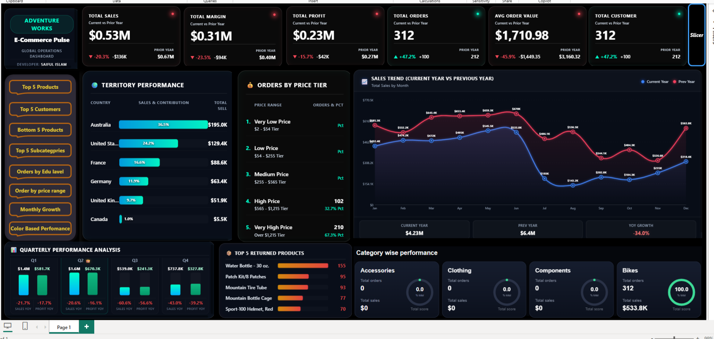

<div align="center">

# 🚴‍♂️ Adventure Works — E-Commerce Pulse
### Global Operations Dashboard

**A fully custom, glass-morphic Power BI dashboard built from scratch — every card, KPI tile, gauge, and chart is hand-engineered in DAX + HTML/CSS/SVG, not a single default visual.**


</div>

---

## 🖼️ Preview

<div align="center">

</div>

---

## 📌 About the Project

**E-Commerce Pulse** is a single-page, dark-themed executive dashboard built on the **Adventure Works** sales dataset, designed to feel less like a default Power BI report and more like a **custom product analytics console**.

Instead of relying on Power BI's stock card, gauge, and KPI visuals, this project pushes DAX past its usual limits — using string-building measures (`CONCATENATEX`, `FORMAT`, nested `VAR`) to generate fully custom **HTML/CSS/SVG** components, rendered live through the **HTML Content** visual. The result: glass-effect cards, animated gradient gauges, and pixel-precise layouts that respond to slicers exactly like native visuals — but look nothing like the Power BI default theme.

> 💡 **Why it matters:** this demonstrates DAX fluency well beyond typical `SUM`/`CALCULATE` reporting — dynamic string generation, conditional formatting logic, and front-end design thinking, all inside a BI tool.

---

## ✨ Key Features

| Area | What it does |
|---|---|
| 🟢 **KPI Strip** | Total Sales, Margin, Profit, Orders, AOV, Customers — each with Current vs Prior Year variance, YoY %, and color-coded up/down arrows |
| 🌍 **Territory Performance** | Country-level sales contribution with inline horizontal bar visualization |
| 💰 **Orders by Price Tier** | Segments orders into 5 price bands (Very Low → Very High) with order count & % of total |
| 📈 **Sales Trend (CY vs PY)** | Custom SVG line chart comparing current year vs previous year, month over month, with data-point labels |
| 📊 **Quarterly Performance Analysis** | Sales & profit by quarter with YoY % deltas |
| 🔁 **Top 5 Returned Products** | Ranked horizontal bar list of most-returned SKUs |
| 🏷️ **Category-Wise Performance** | One single visual, four glass cards (Bikes / Accessories / Clothing / Components) each showing Total Orders, Total Sales, and a live radial gauge for % of total sales |
| 🧭 **Navigation Rail** | Custom button-styled bookmarks: Top 5 Products, Top 5 Customers, Bottom 5 Products, Top Subcategories, Orders by Education, Orders by Price Range, Monthly Growth, Color-Based Performance |
| 🎛️ **Global Slicer** | A single slicer drives every visual on the page — all custom HTML measures recalculate live with filter context |

---

## 🧮 Engineering Highlights (DAX)

This isn't a report built with drag-and-drop visuals — the visual layer *is* the DAX layer. A few examples of what's under the hood:

- **`Category Cards HTML`** — one measure that loops over 4 product categories with `CONCATENATEX`, calculates orders/sales/% share per category *inside the filter context*, and emits a complete `<div>` + inline `<svg>` gauge for each — as a single string, rendered by the HTML Content visual.
- **`KPI_*_HTML_Glass`** family — parameterized glass-card generators for Sales, Margin, Profit, Orders, AOV, and Customers, each with current value, prior-year value, variance pill, and YoY arrow color logic baked into the DAX itself.
- **`Sales_Trend_HTML`** — a hand-built SVG line chart (two series, CY vs PY) generated entirely through `GENERATESERIES` + `ADDCOLUMNS`, no charting visual involved.
- **Time-intelligence layer** — a dedicated `DateTable` plus `*_PY`, `*_Variance`, and `*_YOY_Pct` measures for every core KPI, enabling consistent Current-vs-Prior-Year comparisons across the whole report.
- Every custom visual is **slicer-reactive by design** — because the HTML is generated by a measure, not hardcoded, standard Power BI filter propagation handles all the "interactivity" for free.

---

## 🗂️ Data Model

| Table | Role | Rows |
|---|---|---|
| `sales_data` | Fact table (orders, dates, keys, sales/profit) | 25,164 |
| `Products` | Product dimension | 293 |
| `Product Categories` | Category dimension | 4 |
| `Product Subcategories` | Subcategory dimension | 37 |
| `Customer` | Customer dimension | 18,149 |
| `Territory` | Country / region dimension | 10 |
| `Returns products` | Returns fact table | 1,809 |
| `DateTable` | Custom calendar table for time intelligence | — |
| `All measures` | Central measure table (53 measures) | — |

**Relationships:** star-schema style, single-direction, all `Many → One` from `sales_data` out to `Products`, `Customer`, `Territory`, and `DateTable`; `Products` further rolls up to `Product Subcategories` → `Product Categories`.

---

## 📊 Dataset at a Glance

- 📅 **Date range:** Jan 2020 – Jun 2022
- 💵 **Total historical sales:** ~$12.4M
- 🧾 **Total orders:** 25,164
- 👥 **Unique customers:** 17,416
- 🌍 **Countries covered:** 6
- 📦 **Products tracked:** 293 across 4 categories / 37 subcategories
- ↩️ **Returned units logged:** 1,809

---

## 🛠️ Tech Stack

- **Power BI Desktop** — modeling, DAX, report canvas
- **DAX** — measures, time intelligence, dynamic HTML/SVG string generation
- **HTML / CSS / SVG** — rendered via the *HTML Content* custom visual for every glass card, gauge, and chart
- **Star-schema data modeling** — fact + dimension tables with clean relationships

---

## 🚀 Getting Started

1. Clone this repo
   ```bash
   https://github.com/saif146/Adventure-Works-E-Commerce-Pulse.git
   ```
2. Open `Adventure Works E-Commerce Pulse.pbix` in **Power BI Desktop**.
3. Install the free **HTML Content** custom visual from AppSource (required to render the custom HTML/SVG measures).
4. Refresh the data model, then explore — every visual on the page reacts to the global slicer.

---

## 👤 Author

**Saiful Islam**

Global Operations Dashboard — designed & developed end-to-end (data modeling, DAX, and custom HTML/SVG visual design).

⭐ If you found this project interesting, consider giving it a star!
